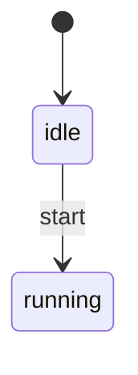

# How to Generate Diagrams

TLX can emit state machine diagrams in four formats from any compiled spec.

## Quick reference

```bash
mix tlx.emit MySpec --format dot       # GraphViz DOT
mix tlx.emit MySpec --format mermaid   # Mermaid (GitHub/GitLab)
mix tlx.emit MySpec --format plantuml  # PlantUML (enterprise)
mix tlx.emit MySpec --format d2        # D2 (Terrastruct)
```

Add `--output file` to write to a file instead of stdout.

## Render to image

**DOT → PNG/SVG** (requires GraphViz):

```bash
dot -Tpng spec.dot -o spec.png
dot -Tsvg spec.dot -o spec.svg
```

**PlantUML → PNG/SVG** (requires plantuml.jar):

```bash
java -jar plantuml.jar spec.puml
java -jar plantuml.jar -tsvg spec.puml
```

**D2 → SVG/PNG** (requires d2 CLI):

```bash
d2 spec.d2 spec.svg
d2 spec.d2 spec.png
```

**Mermaid** renders natively in markdown — no external tool needed.

## Embed in documentation

Mermaid in GitHub markdown:

````markdown

````

Images from other formats:

```markdown

```

## Explicit state variable

If a spec has multiple variables, the emitter auto-detects the "state
variable" (the one with the most atom-valued transitions). Override with:

```bash
mix tlx.emit MySpec --format dot -- --state-var status
```

Or programmatically:

```elixir
TLX.Emitter.Dot.emit(MySpec, state_var: :status)
```

## Generate all formats

```bash
mkdir -p diagrams
for fmt in dot mermaid plantuml d2; do
  mix tlx.emit MySpec --format $fmt --output "diagrams/my_spec.$fmt"
done
```
