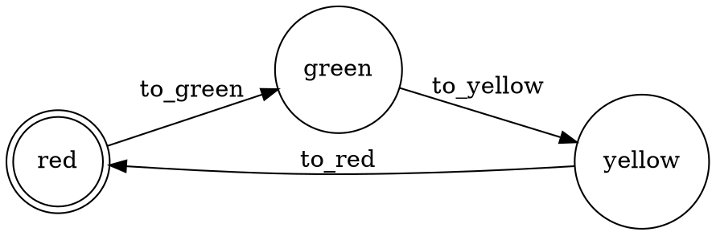

# Sprint 25 — GraphViz State Machine Emitter

**Target Version**: v0.4.0
**Phase**: Visualization
**Status**: Complete

## Goal

Emit GraphViz DOT diagrams from TLX specs, visualizing state machines as directed graphs.

## Deliverables

### 1. `TLX.Emitter.Dot`

New emitter that generates a DOT `digraph`:

- Nodes: distinct atom values of the state variable (collected from defaults, transitions, branches)
- Edges: actions, labeled with the action name
- Source state: extracted from guard conditions (`guard(e(state == :x))`)
- Target state: extracted from `next :state, :y` transitions
- Branches: multiple edges from the same source (one per branch)
- Initial state: marked with a different shape or double circle



### 2. `mix tlx.emit --format dot`

Add `dot` format to the emit task:

```bash
mix tlx.emit TrafficLight --format dot
mix tlx.emit TrafficLight --format dot --output traffic.dot
dot -Tpng traffic.dot -o traffic.png    # render with GraphViz
```

### 3. DSL option for state variable

For specs with multiple variables, the emitter needs to know which variable represents the primary state. Options:

- **Heuristic** (default): pick the variable whose values are all atoms
- **Explicit**: `state_variable :name` option in the DSL or a `--state-var` flag on the mix task

## Design Decisions

- The emitter extracts source states from guard expressions by pattern-matching on `{:==, _, [var_ref, atom]}` in the guard AST. Guards with `and`/`or` are decomposed.
- Actions without a guard on the state variable get edges from all states (or a special "any" node).
- Process-based specs: one subgraph per process.
- The DOT output is plain text — rendering to PNG/SVG is the user's responsibility (standard `dot` command).

## Limitations

- Only works well for specs with atom-valued state variables
- Complex guards (e.g., `state != :done`) produce approximate edges
- Specs with only integer/map state don't have a natural graph

## Acceptance Criteria

- [ ] `TLX.Emitter.Dot.emit/1` produces valid DOT output
- [ ] `mix tlx.emit --format dot` works
- [ ] Traffic light, mutex, and order processing examples produce correct graphs
- [ ] SANY test suite unaffected
- [ ] Documentation: add to mix-tasks reference, expression reference note

## Files

| Action | File                                                    |
| ------ | ------------------------------------------------------- |
| Create | `lib/tlx/emitter/dot.ex`                                |
| Update | `lib/mix/tasks/tlx.emit.ex` — add `dot` format          |
| Update | `docs/reference/mix-tasks.md` — document `--format dot` |
| Create | `test/tlx/emitter/dot_test.exs`                         |
