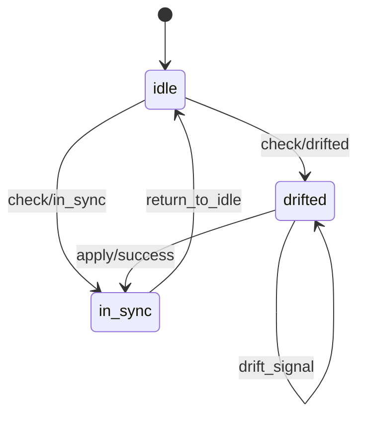

# Tutorial: Extract and Verify a GenServer

This tutorial walks through the full pipeline: extract a spec skeleton
from a GenServer module, enrich it with invariants, and verify it with TLC.

## Prerequisites

- TLX installed (`{:tlx, "~> 0.4.0"}`)
- A GenServer module to extract from
- Java installed (for TLC)

## 1. Extract the skeleton

Suppose you have a reconciler GenServer:

```elixir
defmodule MyApp.Reconciler do
  use GenServer

  def init(_), do: {:ok, %{status: :idle, deps_met: true}}

  def handle_call(:check, _from, state) do
    {:reply, :ok, %{state | status: :in_sync}}
  end

  def handle_cast(:drift_signal, state) do
    {:noreply, %{state | status: :drifted}}
  end
end
```

Run the extractor:

```bash
mix tlx.gen.from_gen_server MyApp.Reconciler --output specs/reconciler_skeleton.ex
```

This produces:

```elixir
defmodule ReconcilerSpec do
  use TLX.Patterns.OTP.GenServer,
    fields: [status: :idle, deps_met: true],
    calls: [
      check: [next: [status: :in_sync]]
    ],
    casts: [
      drift_signal: [next: [status: :drifted]]
    ]
end
```

## 2. Review the extraction

The extractor found:

- Two fields from `init/1`: `status` (`:idle`) and `deps_met` (`true`)
- One call (`:check`) and one cast (`:drift_signal`)
- All transitions are `:high` confidence (literal atoms)

What's missing:

- `:check` always succeeds — in reality it might find drift
- No guard on `:check` — should it only work from `:idle`?
- No invariant beyond the auto-generated `valid_status`

## 3. Enrich the skeleton

Switch from the pattern to a `defspec` for more control:

```elixir
import TLX

defspec ReconcilerSpec do
  variable :status, :idle
  variable :deps_met, true

  action :check do
    guard(e(status == :idle))

    branch :in_sync do
      next :status, :in_sync
    end

    branch :drifted do
      next :status, :drifted
    end
  end

  action :apply do
    guard(e(status == :drifted and deps_met == true))

    branch :success do
      next :status, :in_sync
    end

    branch :failure do
      next :status, :drifted
    end
  end

  action :drift_signal do
    next :status, :drifted
  end

  action :return_to_idle do
    guard(e(status == :in_sync))
    next :status, :idle
  end

  invariant :valid_status,
            e(status == :idle or status == :in_sync or status == :drifted)

  property :eventually_idle, always(eventually(e(status == :idle)))
end
```

Changes from the skeleton:

- Added success/failure branches to `:check`
- Added an `:apply` action with guard requiring `deps_met`
- Added a `return_to_idle` action to close the cycle
- Added a liveness property

## 4. Verify with TLC

```bash
mix tlx.check ReconcilerSpec
```

TLC exhaustively explores all reachable states. If the liveness
property holds, every execution path eventually returns to `:idle`.
If it fails, TLC prints a counterexample trace showing the stuck path.

## 5. Visualize

```bash
mix tlx.emit ReconcilerSpec --format mermaid
```



## Next steps

- Add refinement to an abstract spec (`refines AbstractReconciler do ... end`)
- See the [enrichment checklist](../howto/use-otp-patterns.md) for more patterns
- See [OTP Patterns Reference](../reference/otp-patterns.md) for all options
