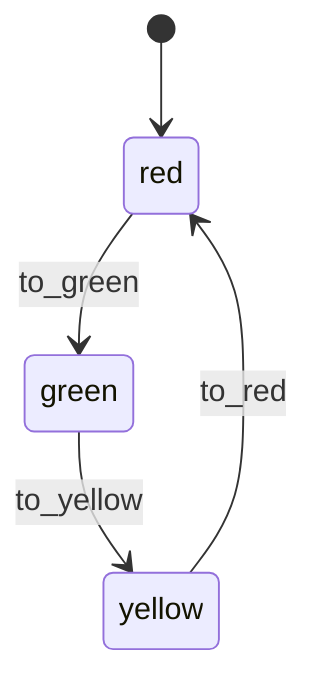

# Tutorial: Visualize a Spec

Generate state machine diagrams from TLX specs and embed them in
documentation, PRs, or wikis.

## Prerequisites

- TLX installed (`{:tlx, "~> 0.4.0"}`)
- A compiled TLX spec module

## 1. Define a spec

```elixir
import TLX

defspec TrafficLight do
  variable :color, :red

  action :to_green do
    guard(e(color == :red))
    next :color, :green
  end

  action :to_yellow do
    guard(e(color == :green))
    next :color, :yellow
  end

  action :to_red do
    guard(e(color == :yellow))
    next :color, :red
  end
end
```

## 2. Generate Mermaid (for GitHub/GitLab)

```bash
mix tlx.emit TrafficLight --format mermaid
```

Output:

```
stateDiagram-v2
    [*] --> red
    red --> green: to_green
    green --> yellow: to_yellow
    yellow --> red: to_red
```

Wrap in a fenced code block to render in markdown:

````markdown

````

## 3. Generate DOT (for image rendering)

```bash
mix tlx.emit TrafficLight --format dot --output traffic.dot
dot -Tpng traffic.dot -o traffic.png
dot -Tsvg traffic.dot -o traffic.svg
```

## 4. Generate PlantUML (for enterprise tools)

```bash
mix tlx.emit TrafficLight --format plantuml --output traffic.puml
java -jar plantuml.jar traffic.puml           # PNG
java -jar plantuml.jar -tsvg traffic.puml     # SVG
```

## 5. Generate D2 (for modern docs)

```bash
mix tlx.emit TrafficLight --format d2 --output traffic.d2
d2 traffic.d2 traffic.svg
```

## All formats at once

```bash
for fmt in dot mermaid plantuml d2; do
  mix tlx.emit TrafficLight --format $fmt --output "diagrams/traffic.$fmt"
done
```

## What the diagrams show

- **Nodes**: distinct state values (atom values of the state variable)
- **Edges**: actions, labeled with action name
- **Branches**: labeled as `action/branch` (e.g., `process/approve`)
- **Initial state**: double circle (DOT), `[*]` (Mermaid/PlantUML), bold (D2)
- **Unguarded actions**: dashed edges from all states (actions without a state guard)

## Choosing a format

| Format   | Best for                         | Rendering                |
| -------- | -------------------------------- | ------------------------ |
| Mermaid  | GitHub PRs, HexDocs, GitLab      | Native — no tools needed |
| DOT      | CI pipelines, automated docs     | `dot` command (GraphViz) |
| PlantUML | Confluence, IntelliJ, enterprise | plantuml.jar or Kroki    |
| D2       | Modern docs, Terrastruct         | `d2` CLI                 |
