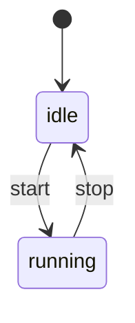

# Visualize — State Machine Diagrams from TLX Specs

Generate state machine diagrams from compiled TLX spec modules in any
of the four supported diagram formats.

## When to Use

- Reviewing a spec's state machine structure visually
- Embedding diagrams in documentation or PRs
- Comparing diagram formats for a project's toolchain
- Sharing spec structure with non-technical stakeholders

## Available Formats

| Format | Best for | Rendering |
|--------|----------|-----------|
| **Mermaid** | GitHub markdown, PRs, HexDocs | Native in GitHub/GitLab |
| **DOT** | GraphViz rendering, CI pipelines | `dot -Tpng file.dot -o file.png` |
| **PlantUML** | Enterprise tools, Confluence, IntelliJ | plantuml.jar, Kroki |
| **D2** | Modern docs, Terrastruct | `d2 file.d2 file.svg` |

## Generate a Diagram

### Single format

```bash
mix tlx.emit MySpec --format mermaid
mix tlx.emit MySpec --format dot --output my_spec.dot
mix tlx.emit MySpec --format plantuml --output my_spec.puml
mix tlx.emit MySpec --format d2 --output my_spec.d2
```

### All formats at once

```bash
for fmt in dot mermaid plantuml d2; do
  mix tlx.emit MySpec --format $fmt --output "diagrams/my_spec.$fmt"
done
```

### Explicit state variable

If the spec has multiple variables, specify which one represents the
primary state:

```bash
mix tlx.emit MySpec --format mermaid --state-var status
```

## Embed in Markdown

Mermaid diagrams render directly in GitHub markdown:

````markdown

````

For other formats, render to PNG/SVG and embed as an image.

## Render to Image

### DOT → PNG/SVG

```bash
mix tlx.emit MySpec --format dot --output spec.dot
dot -Tpng spec.dot -o spec.png
dot -Tsvg spec.dot -o spec.svg
```

### PlantUML → PNG/SVG

```bash
mix tlx.emit MySpec --format plantuml --output spec.puml
java -jar plantuml.jar spec.puml          # produces spec.png
java -jar plantuml.jar -tsvg spec.puml    # produces spec.svg
```

### D2 → SVG/PNG

```bash
mix tlx.emit MySpec --format d2 --output spec.d2
d2 spec.d2 spec.svg
d2 spec.d2 spec.png
```

## What the Diagram Shows

- **Nodes**: distinct states (atom values of the state variable)
- **Edges**: actions, labeled with action name (and branch name if branched)
- **Initial state**: marked with double circle (DOT), `[*]` (Mermaid/PlantUML), or bold (D2)
- **Unguarded actions**: dashed edges from all states (DOT), indicating the action can fire from any state
